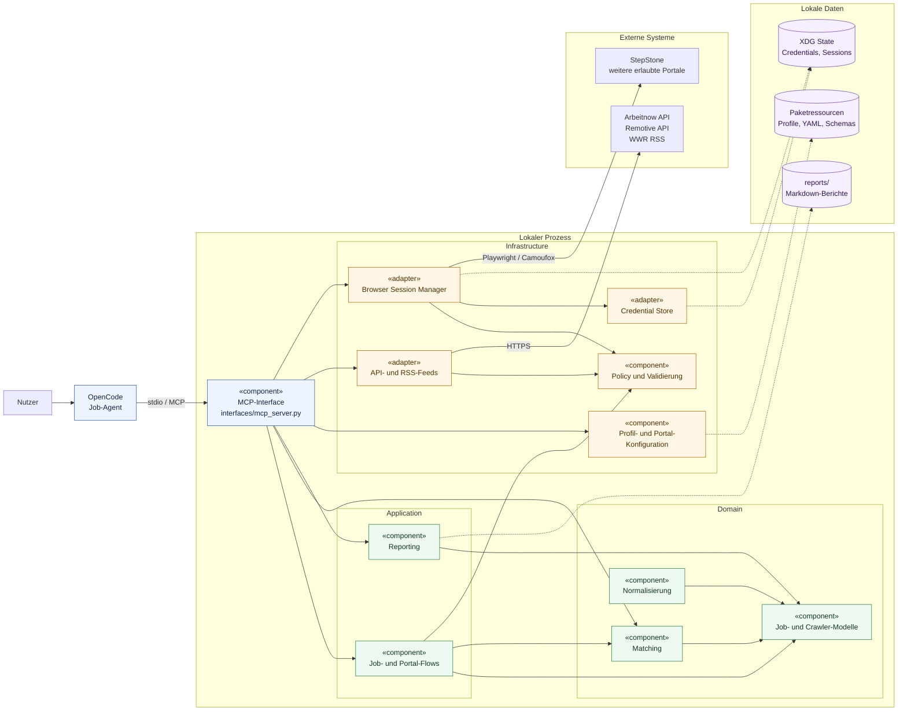

# UML-Komponentendiagramm

Die Komponentensicht zeigt Laufzeitgrenzen und die beabsichtigte
Abhängigkeitsrichtung. Pfeile bedeuten „verwendet“; gestrichelte Pfeile stehen
für Datei- beziehungsweise Ressourcenzugriffe.

## Zentrale Regeln

- Die Domäne importiert keine Browser-, HTTP-, FastAPI- oder MCP-Frameworks.
- Interfaces orchestrieren Anwendungsfälle und Infrastrukturadapter.
- Portalzugriffe werden über Konfiguration und Policy begrenzt.
- Veränderlicher Zustand wird nicht in Paketressourcen geschrieben.
