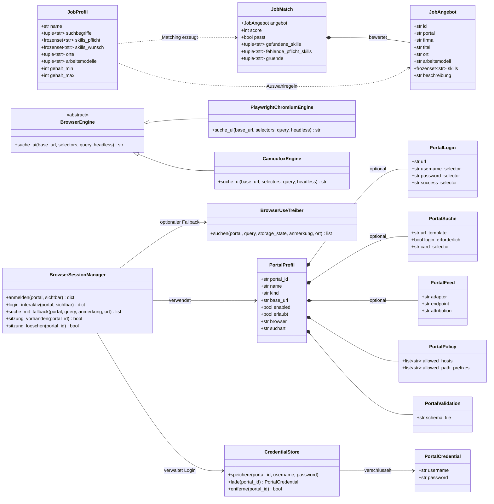

# UML-Klassendiagramm

Das Diagramm konzentriert sich auf die tatsächlich vorhandenen Domänenmodelle,
Portalprofile und austauschbaren Browserimplementierungen. Funktionale
Anwendungsfälle wie `mehrportal_suche` bleiben Funktionen und werden nicht als
künstliche Klassen dargestellt.

## Invarianten

- `JobProfil`, `JobAngebot`, `JobMatch` und `PortalCredential` sind immutable
  Dataclasses.
- Ein `PortalProfil` hat entweder eine Feed-Konfiguration oder einen
  Browser-Suchpfad.
- Ein gespeicherter Loginzustand ist optional; die öffentliche Suche darf ihn
  nicht unnötig voraussetzen.
- `BrowserEngine` hält die Anwendung von Playwright beziehungsweise Camoufox
  unabhängig.
