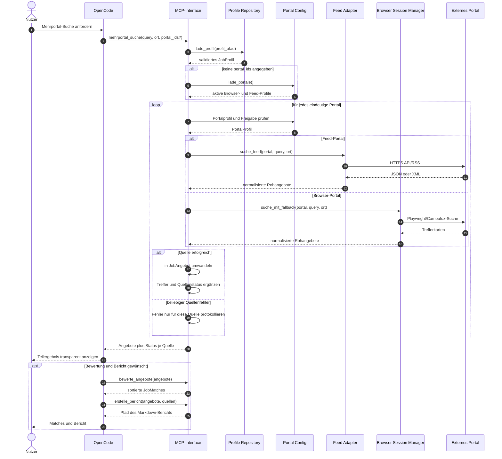

# UML-Sequenzdiagramm: Mehrportal-Suche

Der aktuelle Aggregator verarbeitet die ausgewählten Portale bewusst
nacheinander. Ein Fehler wird je Quelle erfasst und verhindert nicht die
Verarbeitung der folgenden Portale.

## Fehlersemantik

- Profil- und Eingabefehler beenden den gesamten Aufruf.
- Ein nicht freigegebenes, unbekanntes oder vorübergehend fehlerhaftes Portal
  wird als Quellenfehler zurückgegeben.
- Bereits erfolgreiche Quellen bleiben im Resultat erhalten.
