# BPMN-Prozess: Job-Recherche

Die Mermaid-Darstellung bildet den fachlichen BPMN-2.0-Prozess kompakt ab.
Das austauschbare Originalmodell steht in
[`job-recherche.bpmn`](job-recherche.bpmn).

```mermaid
flowchart LR
    subgraph UserLane["Lane: Nutzer / OpenCode"]
        Start((Start))
        Criteria["User Task<br/>Suchkriterien festlegen"]
        Login["User Task<br/>Sichtbar einloggen<br/>inkl. 2FA/Captcha"]
        Errors["User Task<br/>Quellenfehler prüfen"]
        Review["User Task<br/>Matches und Bericht prüfen"]
        InvalidEnd(((Profil ungültig)))
        NoResultEnd(((Keine Quelle erfolgreich)))
        SuccessEnd(((Recherche abgeschlossen)))
    end

    subgraph McpLane["Lane: Job Search MCP"]
        Validate["Service Task<br/>Profil laden und validieren"]
        ProfileValid{"XOR<br/>Profil gültig?"}
        Select["Service Task<br/>Aktive Quellen auswählen"]
        LoginNeeded{"XOR<br/>Login erforderlich?"}
        SaveSession["Service Task<br/>Browserzustand speichern"]
        MergeLogin{"XOR<br/>Pfad zusammenführen"}
        Prepare["Service Task<br/>Anfragen und Policy prüfen"]
        Aggregate["Service Task<br/>Treffer normalisieren<br/>und Fehler isolieren"]
        SourceOk{"XOR<br/>Mindestens eine<br/>Quelle erfolgreich?"}
        Score["Business Rule Task<br/>Angebote bewerten"]
        Report["Service Task<br/>Markdown-Bericht erzeugen"]
    end

    subgraph PortalLane["Lane: Externe Portale"]
        Query["Service Task<br/>API, RSS oder Browser-Suche<br/>je aktiver Quelle"]
    end

    Start --> Criteria --> Validate --> ProfileValid
    ProfileValid -- "Nein" --> InvalidEnd
    ProfileValid -- "Ja" --> Select --> LoginNeeded
    LoginNeeded -- "Ja" --> Login --> SaveSession --> MergeLogin
    LoginNeeded -- "Nein" --> MergeLogin
    MergeLogin --> Prepare --> Query --> Aggregate --> SourceOk
    SourceOk -- "Nein" --> Errors --> NoResultEnd
    SourceOk -- "Ja" --> Score --> Report --> Review --> SuccessEnd

    classDef event fill:#ffffff,stroke:#222,stroke-width:2px;
    classDef user fill:#eef4ff,stroke:#315a9e;
    classDef service fill:#eefaf1,stroke:#2f7d4a;
    classDef gateway fill:#fff6e6,stroke:#a76700;
    classDef external fill:#f6efff,stroke:#7447a8;
    class Start,InvalidEnd,NoResultEnd,SuccessEnd event;
    class Criteria,Login,Errors,Review user;
    class Validate,Select,SaveSession,Prepare,Aggregate,Report service;
    class Score service;
    class ProfileValid,LoginNeeded,MergeLogin,SourceOk gateway;
    class Query external;
```

## Zuordnung zum Code

| BPMN-Aktivität | Implementierung |
|---|---|
| Profil laden und validieren | `infrastructure/profile_repository.py` |
| Aktive Quellen auswählen | `infrastructure/portal_config.py` |
| Sichtbar einloggen | `portal_login` und `BrowserSessionManager` |
| Anfragen und Policy prüfen | Portalprofile, `policy.py`, Feed-/Browseradapter |
| Normalisieren und Fehler isolieren | `portal_suche` und `mehrportal_suche` |
| Angebote bewerten | `domain/matching.py` |
| Bericht erzeugen | `application/reporting.py` |

Der Login-Zweig wird bei öffentlichen Suchen übersprungen. Quellen werden nur
innerhalb ihrer Allowlist angesprochen; technische Zugriffssperren werden nicht
umgangen.
